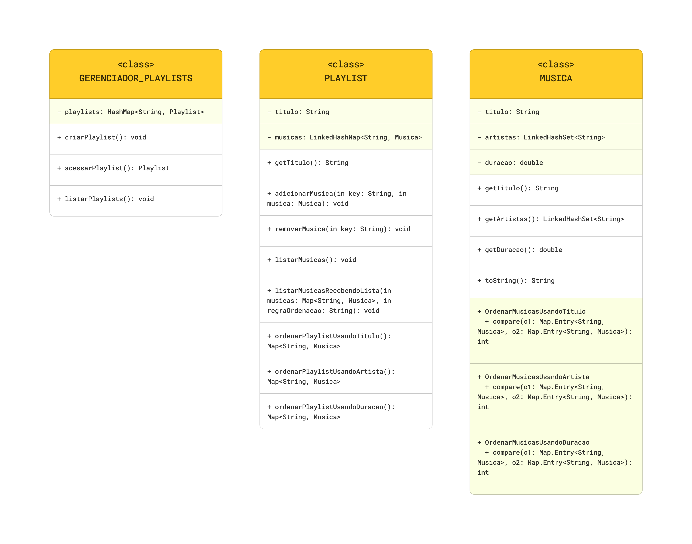

# Gerenciador de Playlists Musicais - Java

| Esse mini-projeto foi desenvolvido para aplicar os conhecimentos básicos sobre Collections.

## Arquivos:
- `Ordenacao`: classe para tratar a ordenacao das musicas
- `Musica`: classe que representa um objeto musica
- `Playlist`: classe que representa um objeto playlist
- `GerenciadorPlaylists`: classe que gerencia as playlists
- `Main`: classe para implementar as classes Musica, Playlist e GerenciadorPlaylists.

## Entrada de dados:
```java
    // criando playlist:
    gerenciadorPlaylists.criarPlaylist("Español, yo hablo");
    gerenciadorPlaylists.criarPlaylist("Brasileiras");
    gerenciadorPlaylists.criarPlaylist("Musicas para relaxar");
    
    // acessando playlist:
    Playlist musicasParaRelaxar = gerenciadorPlaylists.acessarPlaylist("Musicas para relaxar");

    // adicionando playlist:
    musicasParaRelaxar.adicionarMusica("musicaMyWay", new Musica("My Way", Arrays.asList("Limp Bizkit"), 4.33));
    musicasParaRelaxar.adicionarMusica("musicaBeware", new Musica("Beware", Arrays.asList("Deftones"), 6.00));
    
    // ordenando as musicas da playlist usando o título como regra
    Map<String, Musica> musicasOrdenadasPorTitulo = musicasParaRelaxar.ordenarPlaylistUsandoTitulo();
    musicasParaRelaxar.listarMusicasRecebendoLista(musicasOrdenadasPorTitulo, "TITULO");
```

## Melhorias:
- [ ] Tratamento de Erros
- [ ] Melhorar a organização do código
- [ ] Adicionar entrada de dados para que o usuário inserir as informações


## UML das Classes:
